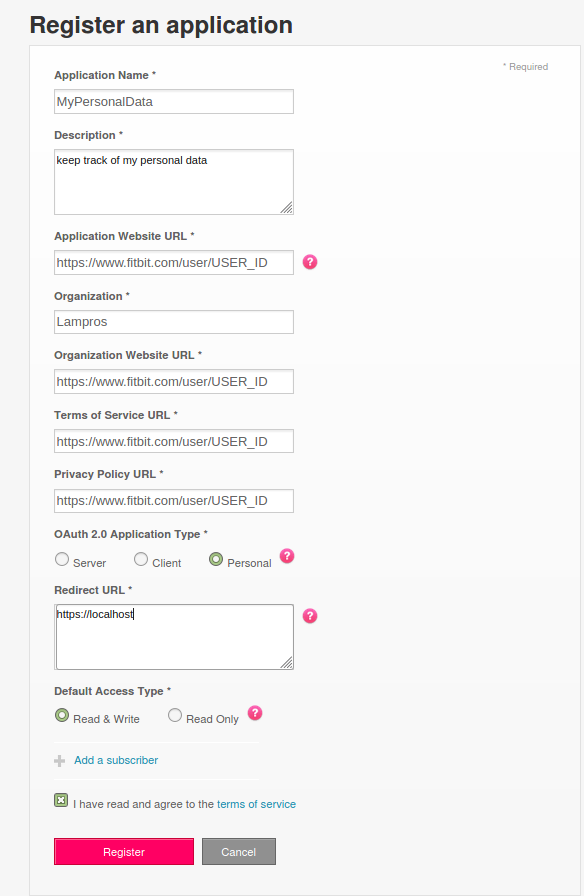
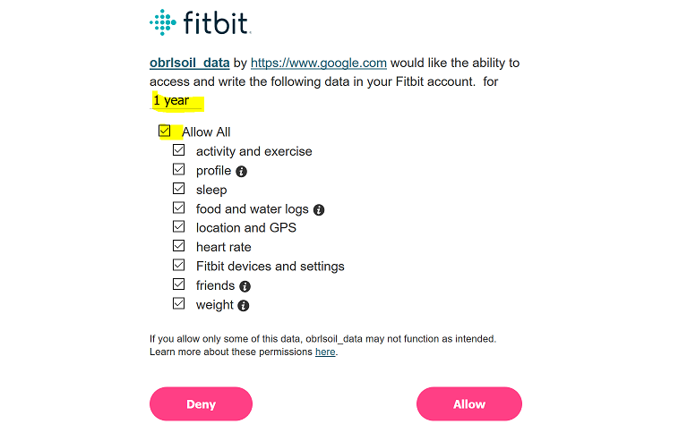
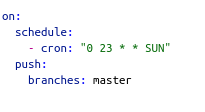
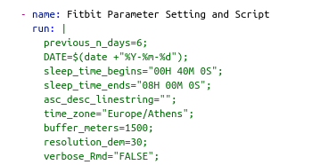
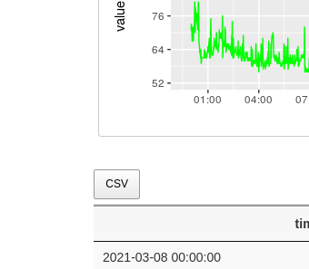

[](https://codecov.io/github/mlampros/fitbitViz?branch=master)
[](http://cran.r-project.org/package=fitbitViz)
[](http://www.r-pkg.org/pkg/fitbitViz)
<a href="https://www.buymeacoffee.com/VY0x8snyh" target="_blank"></a>
[](https://cran.r-project.org/package=fitbitViz)

## fitbitViz

<br>

The **fitbitViz** R package allows the extraction of data and the
visualization of *‘ggplot2’*, *‘Leaflet’* and *3-dimensionsal
‘Rayshader’ Maps* using the [Fitbit Web
API](https://dev.fitbit.com/build/reference/web-api/). If you own any of
the **Fitbit activity trackers** you can take advantage of this package.

The 3-dimensional Rayshader Map requires the installation of the
[CopernicusDEM](https://github.com/mlampros/CopernicusDEM) R package
which includes the **30- and 90-meter elevation data**.

<br>

### Requirements:

<br>

To make use of this R package you have first to **register an
Application** in <https://dev.fitbit.com/>. By registering an
application you will receive the Fitbit **token** which besides your
existing
[user-id](https://community.fitbit.com/t5/Web-API-Development/Where-do-I-find-my-User-ID/m-p/1138667/highlight/true#M4375)
is required so that you can take advantage of the **fitbitViz**
functions.

There are many resources on the web on how to setup a Fitbit
application. I modified the following
[guide](https://obrl-soil.github.io/fitbit-api-r/) which explains in
detail how to register an application and then receive a token to
retrieve the Fitbit data for a specific time period (maximum a year).
The next images and comments explain the whole process,

-   Go to <https://dev.fitbit.com/> and click on **Manage &gt; Register
    an App**

    **Login with your Fitbit credentials** and follow the prompts. I
    used as URL in the Registration Page **my Fitbit user-id** url,
    **`https://www.fitbit.com/user/USER_ID`**. You have to replace the
    **USER\_ID** in the url with [your specific
    user-id](https://community.fitbit.com/t5/Web-API-Development/Where-do-I-find-my-User-ID/m-p/1138667/highlight/true#M4375).
    Then in the **Redirect URL** field use **`https://localhost`**. Tick
    the remaining options as in the next image, *read and agree to the
    terms of service* and click **Register** to register the
    application.

    

-   Once the app is created, click on the ‘OAuth 2.0 tutorial page’
    weblink near the bottom of the screen:

    

-   Scroll down to the end of **1. Authorize** and **right click** on
    the provided **authorization URL** (in blue color) to open this URL
    on a new web browser tab which will show the Fitbit authorization
    interface. Change the auth period to **1 year** so that you don’t
    have to go through this too often and tick all options before
    clicking *Allow* (you will probably play with the other endpoints at
    some point in the future)

    

-   After clicking *Allow*, the browser tab redirects to the callback
    URL. You’ll have to **copy and paste the full URL** which now
    includes also the **access token** to the **2. Parse response**
    header of the previous tab (where we have seen also the *1.
    Authorize* section). The required **access token** for your
    application that you can use in this package will appear below the
    text box (it’s a long string of characters).

<br>

You now have your **token** and can start using the **fitbitViz** R
package to access and visualize your data.

<br>

### Keep track of your activities using ‘fitbitViz’, ‘Blogdown’ and ‘Github Actions’

<br>

The functions of the **fitbitViz** R package can be used in an automatic
way so that the user can keep track of the **Visualizations** and
**data** over time.

From the first moment I’ve started implementing the **fitbitViz** R
package this is what I actually had in my mind. You can have a look to
[my Fitbit Visualizations
website](https://mlampros.github.io/fitbitVizBlog/). The following steps
explain in detail how this can be achieved:

-   Fork the [fitbitVizBlog]() repository
-   Create the following **secrets** required for the
    [.github/workflows/gh\_fitbit\_blog.yaml](https://github.com/mlampros/fitbitVizBlog/blob/master/.github/workflows/gh_fitbit_blog.yaml)
    file by navigating to **Settings** &gt;&gt; **secrets** (*be aware
    that the **AWS\_ACCESS\_KEY\_ID** and **AWS\_SECRET\_ACCESS\_KEY**
    are optional and required only if you want to receive the
    **3-dimensional** Rayshader Visualization*)
    -   **USER\_ID**: click on ‘New repository secret’ and use
        **USER\_ID** as **Name** and your Fitbit
        [user-id](https://community.fitbit.com/t5/Web-API-Development/Where-do-I-find-my-User-ID/m-p/1138667/highlight/true#M4375)
        as **Value**
    -   **FITBIT\_TOKEN**: click on ‘New repository secret’ and use
        **FITBIT\_TOKEN** as **Name** and the **token** you received
        from your previously registered Fitbit application as **Value**
    -   **GH\_PAT**: First create a [Personal Access
        Token](https://github.com/settings/tokens) by giving as **Note**
        a name and then ticking in **Select scopes** the **workflow**
        (Update GitHub Action workflows) scope and lastly click on
        **Generate Token**. Then click on ‘New repository secret’ and
        use **GH\_PAT** as **Name** and the copied **Generated Token**
        as **Value**
    -   **EMAIL**: click on ‘New repository secret’ and use **EMAIL** as
        **Name** and the **e-mail** you use on Github as **Value**
    -   **AWS\_ACCESS\_KEY\_ID**: click on ‘New repository secret’ and
        use **AWS\_ACCESS\_KEY\_ID** as **Name** and insert your **aws
        access key id** in the **Value** field ( the aws credentials are
        required for the Copernicus Elevation Data, this [guide explains
        how to receive the aws
        credentials](https://supsystic.com/documentation/id-secret-access-key-amazon-s3/)
        )
    -   **AWS\_SECRET\_ACCESS\_KEY**: click on ‘New repository secret’
        and use **AWS\_SECRET\_ACCESS\_KEY** as **Name** and insert your
        **aws secret access key** in the **Value** field

What it remains is to modify the
[.github/workflows/gh\_fitbit\_blog.yaml](https://github.com/mlampros/fitbitVizBlog/blob/master/.github/workflows/gh_fitbit_blog.yaml)
file to adjust the

-   current **cron-job** settings which runs every Sunday at 23:00 pm
    -   
-   current **fitbitViz** parameters
    -   

Regarding the **fitbitViz** parameters
([.github/workflows/gh\_fitbit\_blog.yaml](https://github.com/mlampros/fitbitVizBlog/blob/master/.github/workflows/gh_fitbit_blog.yaml)
file) at it’s current state the application takes:

-   **previous\_n\_days**: this parameter specifies the number of days
    before the current **DATE** for which the Fitbit data will be
    downloaded (I’ve set it to **6** to visualize and access data of the
    **last** week)
-   **DATE**: this parameter corresponds to the current Date ( the Date
    that the **Cron-Job** runs ). You can set this parameter also to a
    character string such as **DATE=“2021-05-16”;** if you want to use
    as the end Date this specific date.
-   **sleep\_time\_begins**: this is your scheduled sleep time in form
    of a **lubridate::hms(“00H 40M 0S”)** object (adjust the input
    depending on your sleep time)
-   **sleep\_time\_ends**: this is your scheduled wake up time in form
    of a **lubridate::hms(“08H 00M 0S”)** object (adjust the input
    depending on your wake up time)
-   **asc\_desc\_linestring**: this parameter is related to the GPS data
    of the **3-dimensional** map especially if you keep track of your
    outdoor activities. There are **3 options**:
    -   by specifying **asc\_desc\_linestring="";** a single LINESTRING
        will be created based on the GPS data using a single color
    -   by specifying **asc\_desc\_linestring=“TRUE”;** the LINESTRING
        of the GPS data will be split into 2 parts using the highest
        elevation location as a split point (**blue** color for the
        ascending part and **red** color for the descending part)
    -   by specifying **asc\_desc\_linestring=“17H 5M 0S”;** the GPS
        data will be split into 2 parts using this input time as split
        point (adjust the time based on your data)
-   **time\_zone**: your current time zone as specified in
    **lubridate::ymd\_hms(tz = ..)** function (it defaults to my current
    time zone which is **Europe/Athens**)
-   **buffer\_meters**: this parameter extends the 3-dimensional map by
    **N-meters** (the current default value is **1500** meters)
-   **resolution\_dem**: this parameter takes either **30** or **90**
    and corresponds to the resolution of the Copernicus elevation data
    (the current default value is **30** meters)
-   **verbose\_Rmd**: this last parameter is just for debugging in case
    you want to enable verbosity in the output **.Rmd** file (it
    defaults to “FALSE” and it takes also “TRUE” as input)

<br>

The order to *modify*, *debug* or *include new code / functions* to the
files of this Github Repository is the following:

-   first modify the **gh\_fitbit\_blog.yaml** file
-   then modify the *R code* of the **R\_templates/data\_template.R**
    file
-   and finally modify the *Rmd code* of the
    **R\_templates/functions\_template.Rmd** file

<br>

One **important** thing to keep in mind is that besides the
Visualizations the user has access also to the pre-processed Fitbit data
by clicking to a **CSV** button as shown in the next image,

<br>



<br>

-   **References**:
    -   <https://registry.opendata.aws/copernicus-dem/>
    -   <https://dev.fitbit.com/build/reference/web-api/>
    -   <https://obrl-soil.github.io/fitbit-api-r/>
    -   <https://github.com/orchid00/actions_sandbox/issues/41#issuecomment-816970613>
    -   <https://blog--simonpcouch.netlify.app/blog/r-github-actions-commit/>

<br>

### Package Installation & Citation:

<br>

To install the package from CRAN use,

``` r
install.packages("fitbitViz")
```

<br>

and to download the latest version of the package from Github,

``` r
remotes::install_github('mlampros/fitbitViz')
```

<br>

If you use the **fitbitViz** R package in your paper or research please
cite `https://CRAN.R-project.org/package=fitbitViz`:

<br>

``` r
@Manual{,
  title = {{fitbitViz}: Fitbit Visualizations},
  author = {Lampros Mouselimis},
  year = {2021},
  note = {R package version 1.0.0},
  url = {https://CRAN.R-project.org/package=fitbitViz},
}
```

<br>
