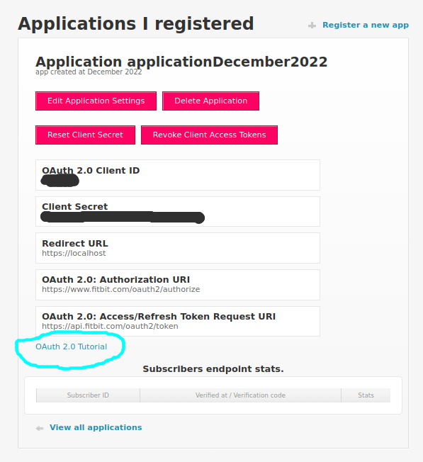

[](https://github.com/mlampros/fitbitViz/actions)
[](https://codecov.io/github/mlampros/fitbitViz?branch=master)
[](http://cran.r-project.org/package=fitbitViz)
[](http://www.r-pkg.org/pkg/fitbitViz)
<a href="https://www.buymeacoffee.com/VY0x8snyh" target="_blank"></a>
[](https://hub.docker.com/r/mlampros/fitbitviz)
[](https://cran.r-project.org/package=fitbitViz)

## fitbitViz

<br>

The **fitbitViz** R package allows the extraction of data and the
visualization of *‘ggplot2’*, *‘Leaflet’* and *3-dimensionsal
‘Rayshader’ Maps* using the [Fitbit Web
API](https://dev.fitbit.com/build/reference/web-api/). If you own any of
the **Fitbit activity trackers** you can take advantage of this package.
A detailed explanation of the functionality can be found both in the
Vignette and in the [blog
post](http://mlampros.github.io/2021/05/20/fitbitViz_package/).

The 3-dimensional Rayshader Map requires the installation of the
[CopernicusDEM](https://github.com/mlampros/CopernicusDEM) R package
which includes the **30- and 90-meter elevation data**.

<br>

### Requirements:

<br>

To make use of this R package you have first to **register an
Application** in <https://dev.fitbit.com/>. By registering an
application you will receive the Fitbit **token** which besides your
existing
[user-id](https://community.fitbit.com/t5/Web-API-Development/Where-do-I-find-my-User-ID/m-p/1138667/highlight/true#M4375)
is required so that you can take advantage of the **fitbitViz**
functions.

There are many resources on the web on how to setup a Fitbit
application. The [Fitbit web API
documenation](https://dev.fitbit.com/build/reference/web-api/) includes
more details. The next images and comments explain the whole process,

-   Go to <https://dev.fitbit.com/> and click on **Manage &gt; Register
    an App**

    **Login with your Fitbit credentials** and follow the prompts. I
    used as URL in the Registration Page **my Fitbit user-id** url,
    **`https://www.fitbit.com/user/USER_ID`**. You have to replace the
    **USER\_ID** in the url with [your specific
    user-id](https://community.fitbit.com/t5/Web-API-Development/Where-do-I-find-my-User-ID/m-p/1138667/highlight/true#M4375).
    Then in the **Redirect URL** field use **`https://localhost`**. Tick
    the remaining options as in the next image, *read and agree to the
    terms of service* and click **Register** to register the
    application.

    

-   Once the app is created, click on the ‘OAuth 2.0 Tutorial’ weblink
    near the bottom of the screen:

    

-   In the ‘Fitbit OAuth 2.0 Tutorial’ website the **Client ID** already
    exists and we have to copy-paste the **Client Secret** from the
    previous web page

    

-   then we scroll down to the ‘Getting an Access Token’ section and
    click to the two “Generate” buttons to generate the required codes,

    

-   In the next section ‘Step 2: Display Authorization Page’ we click to
    the already created URL which will open a new tab to our web
    browser,

    

-   in this new web page tick the **Allow All** and click the **Allow**
    button

    

-   After clicking *Allow*, the browser tab redirects to the callback
    URL. Although this might seem like an “Unable to connect” web page
    the important thing here is to just copy the URL of the web page as
    follows,

    

-   and paste it to the section “Step 3: Handle the Redirect” where the
    “Authorization code” and “State” will be created,

    

-   finally in section “Step 4: Get Tokens” we just click to the
    **SUBMIT REQUEST** button to receive the token in the **Response**
    field,

    

<br>

The **parsed response** looks as follows,


<br>

You now have your **Access Token** and can start using the **fitbitViz**
R package to access and visualize your data. Keep in mind that the
*Access token* is **valid for 8 hours**. Based on the documentation of
the fitbit API

*“After the Access Token expiration time has passed your requests will
receive a 401 HTTP error. When this happens, your app should use the
Refresh Token to get a new pair of tokens”*.

To refresh the token the user of the *fitbitViz* R package can use the
***refresh\_token\_app()*** function, which requires the **client id**,
**client secret** and **refresh token** of your registered Fitbit
application, in the following way:

<br>

``` r
require(fitbitViz)

#..............................................
# Refresh token once it expires (after 8 hours)
#..............................................

client_id = 'xxxxxx'
client_secret = 'xxxxxxxxxxxxxxxxxx'
refresh_token = 'xxxxxxxxxxxxxxxxxxxxxxxx'

# refresh the token
new_token = refresh_token_app(client_id = client_id,
                              client_secret = client_secret,
                              refresh_token = refresh_token)

# a named list that includes the new 'access_token' and 'refresh_token'
str(new_token)
```

<br>

### Keep track of your activities using ‘fitbitViz’, ‘Blogdown’ and ‘Github Actions’

<br>

**UPDATE 26-12-2022**: The registration of an Application of the *fitbit
web API* has changed and it seems that users have to refresh the token
every 8 hours. The following instructions were meant to be used with a
registered application that wouldn’t require to refresh the token for 1
year.

<br>

The functions of the **fitbitViz** R package can be used in an automatic
way so that the user can keep track of the **Visualizations** and
**data** over time.

From the first moment I’ve started implementing the **fitbitViz** R
package this is what I actually had in my mind. You can have a look to
[my Fitbit Visualizations
website](https://mlampros.github.io/fitbitVizBlog/). The following steps
explain in detail how this can be achieved:

-   Fork the [fitbitVizBlog](https://github.com/mlampros/fitbitVizBlog)
    repository ( **!!! Not this repository but the one that includes the
    blog posts !!!** )
-   Create the following **secrets** required for the
    [.github/workflows/gh\_fitbit\_blog.yaml](https://github.com/mlampros/fitbitVizBlog/blob/master/.github/workflows/gh_fitbit_blog.yaml)
    file by navigating to **Settings** &gt;&gt; **secrets** (*be aware
    that the **AWS\_ACCESS\_KEY\_ID** and **AWS\_SECRET\_ACCESS\_KEY**
    are optional and required only if you want to receive the
    **3-dimensional** Rayshader Visualization*)
    -   **USER\_ID**: click on ‘New repository secret’ and use
        **USER\_ID** as **Name** and your Fitbit
        [user-id](https://community.fitbit.com/t5/Web-API-Development/Where-do-I-find-my-User-ID/m-p/1138667/highlight/true#M4375)
        as **Value**
    -   **FITBIT\_TOKEN**: click on ‘New repository secret’ and use
        **FITBIT\_TOKEN** as **Name** and the **token** you received
        from your previously registered Fitbit application as **Value**
    -   **GH\_PAT**: First create a [Personal Access
        Token](https://github.com/settings/tokens) by giving as **Note**
        a name and then ticking in **Select scopes** the **workflow**
        (Update GitHub Action workflows) scope and lastly click on
        **Generate Token**. Then click on ‘New repository secret’ and
        use **GH\_PAT** as **Name** and the copied **Generated Token**
        as **Value**
    -   **EMAIL**: click on ‘New repository secret’ and use **EMAIL** as
        **Name** and the **e-mail** you use on Github as **Value**
    -   **AWS\_ACCESS\_KEY\_ID**: click on ‘New repository secret’ and
        use **AWS\_ACCESS\_KEY\_ID** as **Name** and insert your **aws
        access key id** in the **Value** field ( the aws credentials are
        required for the Copernicus Elevation Data, this [guide explains
        how to receive the aws
        credentials](https://supsystic.com/documentation/id-secret-access-key-amazon-s3/)
        )
    -   **AWS\_SECRET\_ACCESS\_KEY**: click on ‘New repository secret’
        and use **AWS\_SECRET\_ACCESS\_KEY** as **Name** and insert your
        **aws secret access key** in the **Value** field

What it remains is to modify the
[.github/workflows/gh\_fitbit\_blog.yaml](https://github.com/mlampros/fitbitVizBlog/blob/master/.github/workflows/gh_fitbit_blog.yaml)
file to adjust the

-   current **cron-job** settings which runs every Sunday at 23:00 pm
    -   
-   current **fitbitViz** parameters
    -   

Regarding the **fitbitViz** parameters
([.github/workflows/gh\_fitbit\_blog.yaml](https://github.com/mlampros/fitbitVizBlog/blob/master/.github/workflows/gh_fitbit_blog.yaml)
file) at it’s current state the application takes:

-   **DATE**: this parameter corresponds to the current Date ( the Date
    that the **Cron-Job** runs ). You can set this parameter also to a
    character string such as **DATE=“2021-05-16”;** if you want to use
    as the end Date this specific date. **Be Aware** this parameter is
    defined in a separate github action step.
-   **previous\_n\_days**: this parameter specifies the number of days
    before the current **DATE** for which the Fitbit data will be
    downloaded (I’ve set it to **6** to visualize and access data of the
    **last** week)
-   **sleep\_time\_begins**: this is your scheduled sleep time in form
    of a **lubridate::hms(“00H 40M 0S”)** object (adjust the input
    depending on your sleep time)
-   **sleep\_time\_ends**: this is your scheduled wake up time in form
    of a **lubridate::hms(“08H 00M 0S”)** object (adjust the input
    depending on your wake up time)
-   **asc\_desc\_linestring**: this parameter is related to the GPS data
    of the **3-dimensional** map especially if you keep track of your
    outdoor activities. There are **3 options** but before making use of
    the **2nd. option make sure** that there is an ascending and
    descending route, otherwise it will give an error:
    1.  by specifying **asc\_desc\_linestring="";** a single LINESTRING
        will be created based on the GPS data using a single color
    2.  by specifying **asc\_desc\_linestring=“TRUE”;** the LINESTRING
        of the GPS data will be split into 2 parts using the highest
        elevation location as a split point (**blue** color for the
        ascending part and **red** color for the descending part)
    3.  by specifying **asc\_desc\_linestring=“17H 5M 0S”;** the GPS
        data will be split into 2 parts using this input time as split
        point (adjust the time based on your data)
-   **time\_zone**: your current time zone as specified in
    **lubridate::ymd\_hms(tz = ..)** function (it defaults to my current
    time zone which is **Europe/Athens**)
-   **buffer\_meters**: this parameter extends the 3-dimensional map by
    **N-meters** (the current default value is **1500** meters)
-   **resolution\_dem**: this parameter takes either **30** or **90**
    and corresponds to the resolution of the Copernicus elevation data
    (the current default value is **30** meters)
-   **verbose\_Rmd**: this last parameter is just for debugging in case
    you want to enable verbosity in the output **.Rmd** file (it
    defaults to “FALSE” and it takes also “TRUE” as input)

<br>

The order to *modify*, *debug* or *include new code / functions* to the
files of this Github Repository is the following:

-   first modify the **gh\_fitbit\_blog.yaml** file
-   then modify the *R code* of the **R\_templates/data\_template.R**
    file
-   and finally modify the *Rmd code* of the
    **R\_templates/functions\_template.Rmd** file

<br>

One **important** thing to keep in mind is that besides the
Visualizations the user has access also to the pre-processed Fitbit data
by clicking to a **CSV** button as shown in the next image,

<br>


<br>

-   **References**:
    -   <https://registry.opendata.aws/copernicus-dem/>
    -   <https://dev.fitbit.com/build/reference/web-api/>
    -   <https://github.com/orchid00/actions_sandbox/issues/41#issuecomment-816970613>
    -   <https://blog--simonpcouch.netlify.app/blog/r-github-actions-commit/>

<br>

### Docker Image:

<br>

**Docker images** of the *fitbitViz* package are available to download
from my [dockerhub](https://hub.docker.com/r/mlampros/fitbitviz)
account. The images come with *Rstudio* and the *R-development* version
(latest) installed. The whole process was tested on Ubuntu 18.04. To
**pull** & **run** the image do the following,

<br>

``` r
docker pull mlampros/fitbitviz:rstudiodev

docker run -d --name rstudio_dev -e USER=rstudio -e PASSWORD=give_here_your_password --rm -p 8787:8787 mlampros/fitbitviz:rstudiodev
```

<br>

The user can also **bind** a home directory / folder to the image to use
its files by specifying the **-v** command,

<br>

``` r
docker run -d --name rstudio_dev -e USER=rstudio -e PASSWORD=give_here_your_password --rm -p 8787:8787 -v /home/YOUR_DIR:/home/rstudio/YOUR_DIR mlampros/fitbitviz:rstudiodev

```

<br>

In the latter case you might have first give permission privileges for
write access to **YOUR\_DIR** directory (not necessarily) using,

<br>

``` r
chmod -R 777 /home/YOUR_DIR

```

<br>

The **USER** defaults to *rstudio* but you have to give your
**PASSWORD** of preference (see
[www.rocker-project.org](https://rocker-project.org/) for more
information).

<br>

Open your web-browser and depending where the docker image was *build /
run* give,

<br>

**1st. Option** on your personal computer,

<br>

``` r
http://0.0.0.0:8787 
```

<br>

**2nd. Option** on a cloud instance,

<br>

``` r
http://Public DNS:8787
```

<br>

to access the Rstudio console in order to give your username and
password.

<br>

### Package Installation & Citation:

<br>

To install the package from CRAN use,

``` r
install.packages("fitbitViz")
```

<br>

and to download the latest version of the package from Github,

``` r
remotes::install_github('mlampros/fitbitViz')
```

<br>

If you use the **fitbitViz** R package in your paper or research please
cite `https://CRAN.R-project.org/package=fitbitViz`:

<br>

``` r
@Manual{,
  title = {{fitbitViz}: Fitbit Visualizations},
  author = {Lampros Mouselimis},
  year = {2022},
  note = {R package version 1.0.5},
  url = {https://CRAN.R-project.org/package=fitbitViz},
}
```

<br>
