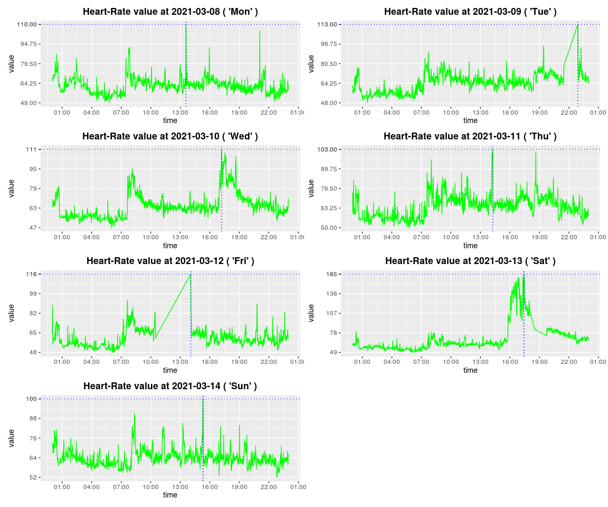
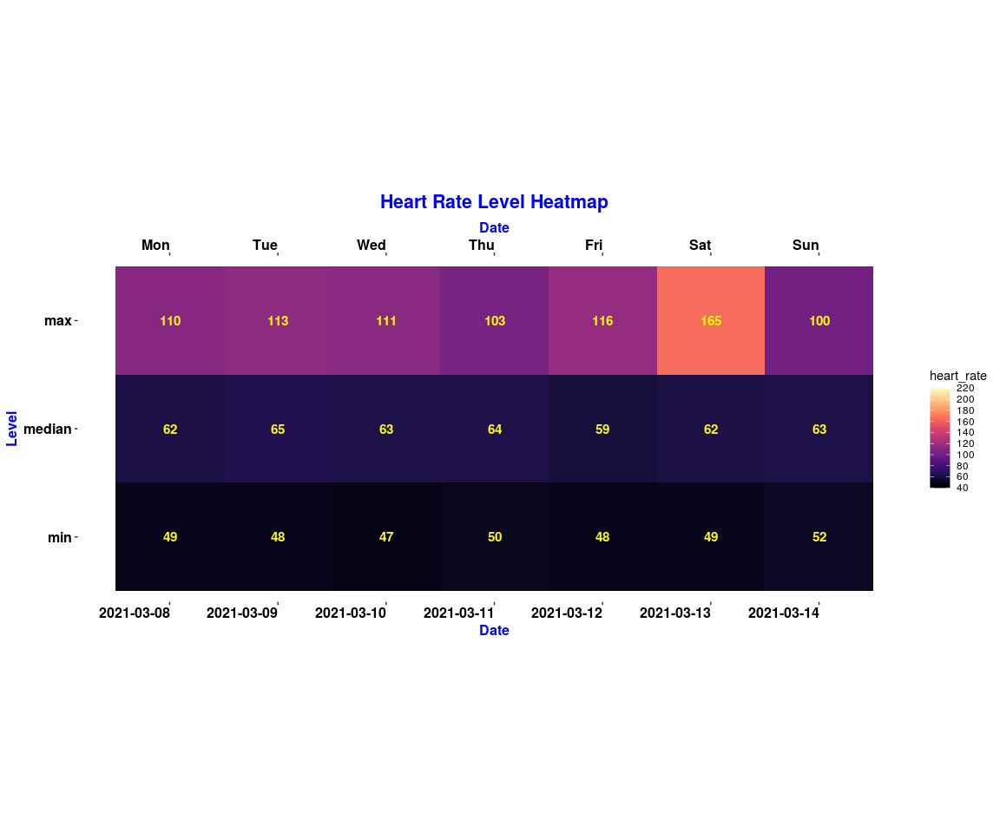
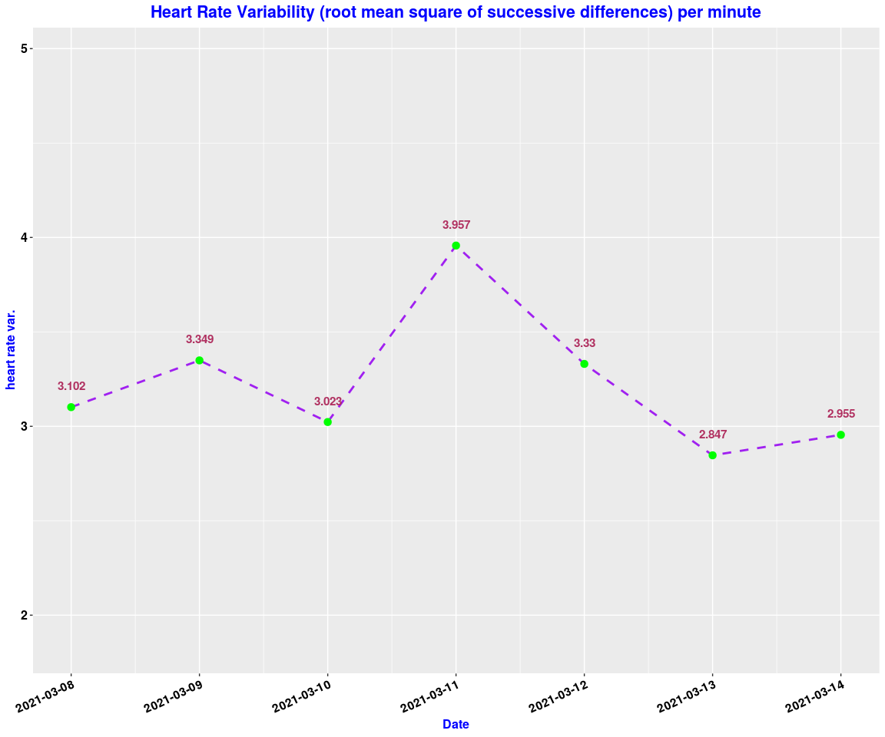
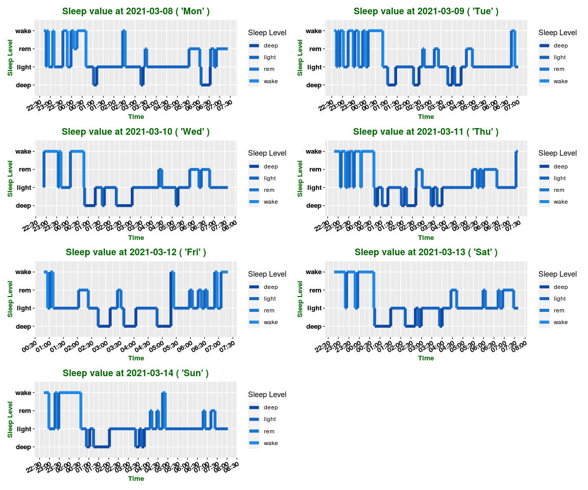
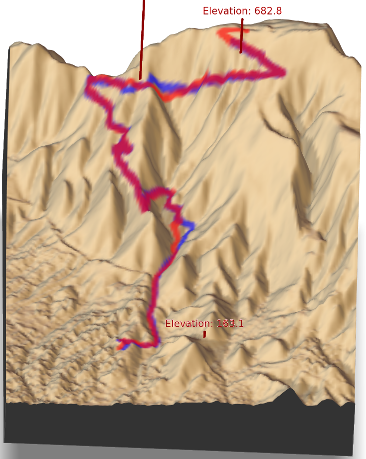

# Functionality of the fitbitViz R package

  

The purpose of this Vignette is to show the main functionality of the
**fitbitViz** R package. Starting with version **1.0.8** the package no
longer connects to the Fitbit Web API — all functions accept
**pre-downloaded data** directly. The examples below use the bundled
`.RDS` fixture files from `inst/tests_vignette_rds/` which are loaded
automatically in the setup chunk above.

  

We can now define the remaining variables,

  

``` r
WEEK <- 11 # for this use case pick the 11th week of the year 2021

weeks_2021 <- fitbitViz:::split_year_in_weeks(year = 2021) # split a year in weeks

# Start the week at monday (see: https://github.com/tidyverse/lubridate/issues/509)
date_start <- lubridate::floor_date(lubridate::ymd(weeks_2021[WEEK]), unit = "weeks") + 1

# Add 6 days to the 'date_start' variable to come to a 7-days plot
date_end <- date_start + 6

sleep_time_begins <- "00H 40M 0S"
sleep_time_ends <- "08H 00M 0S"

VERBOSE <- FALSE # disable verbosity
```

  

The previous code snippet uses one week of my personal *Fitbit* data
(the *11th week of 2021*) to plot my

- **heart rate time series**
- **heart rate heatmap**
- **heart rate variability during sleep time**
- **sleep time series**
- **GPS data of outdoor activities**
- **3-dimensional map of activities**

The data for all these functions are available to download using the
**csv** buttons in this *Rmarkdown* file.

  

### heart rate time series

  

The **heart_rate_time_series()** function accepts the
**heart_rate_intraday_list** (a named list of intraday data.tables, one
per date) and an optional **heart_rate** summary data.frame, along with
the **detail level** (1 minute), and returns the **heart rate time
series**. Each output plot (of the *multiplot*) includes in the
**x-axis** the **time** and in the **y-axis** the **heart rate value**.
The highest heart rate value (peak) of the day is highlighted using a
vertical and horizontal **blue** line,

  

``` r
# .......................
# heart rate time series
# .......................

heart_dat <- fitbitViz::heart_rate_time_series(
  heart_rate_intraday_list = heart_dat$heart_rate_intraday,
  heart_rate = heart_dat$heart_rate,
  detail_level = "1min",
  ggplot_intraday = TRUE,
  ggplot_ncol = 2,
  ggplot_nrow = 4,
  verbose = VERBOSE
)
heart_dat$plt
```

  



  

  

### heart rate heatmap

  

The **heart rate heatmap** shows the **min**, **median** and **max**
heart rate Levels in the **y-axis** for each day of the specified week
(**x-axis**). As the legend shows, the displayed values range from 40 to
220 and higher values appear in *purple* or *orange* color,

  

``` r
# ............................
# heart rate intraday heatmap [ plot options: https://yihui.org/knitr/options/#plots ]
# ............................

heart_intra <- heart_dat$heart_rate_intraday

hrt_heat <- fitbitViz::heart_rate_heatmap(
  heart_rate_intraday_data = heart_intra,
  angle_x_axis = 0
)
hrt_heat
```

  



  

### heart rate variability during sleep time

  

Heart Rate Variability (HRV) intraday data for a single date. HRV data
applies specifically to a user’s “main sleep”, which is the longest
single period of time asleep on a given date. It measures the HRV rate
at various times and returns the *Root Mean Square of Successive
Differences (rmssd)*, *Low Frequency (LF)*, *High Frequency (HF)*, and
*Coverage* data for a given measurement. **Rmssd** measures short-term
variability in your heart rate while asleep. **LF** and **HF** capture
the power in interbeat interval fluctuations within either high
frequency or low frequency bands. Finally, **coverage** refers to data
completeness in terms of the number of interbeat intervals. The
**fitbit_data_type_by_date()** function allows the user to also compute
the ‘spo2’ (Blood Oxygen Saturation), ‘br’ (Breathing Rate), ‘temp’
(Temperature) and ‘cardioscore’ (Cardio Fitness Score or VO2 Max) by
adjusting the **type** parameter.

  

``` r
# .......................
# heart rate variability
# .......................

hrt_rt_var <- fitbitViz::fitbit_data_type_by_date(
  data = heart_dat,
  type = "hrv",
  plot = TRUE
)
```

  



  

### sleep time series

  

The **sleep time series** visualization is similar to the *Fitbit
Mobile* Visualization and in the **x-axis** shows the specified by the
user **sleep time interval** whereas in the **y-axis** shows the **sleep
Levels** (*wake*, *rem*, *light*, *deep*). Lower levels like *deep
sleep* appear in dark blue whereas higher levels like *wake* appear in
light blue,

  

``` r
# .......................
# sleep data time series
# .......................

sleep_ts <- fitbitViz::sleep_time_series(
  sleep_data_list = sleep_ts,
  ggplot_color_palette = "ggsci::blue_material",
  ggplot_ncol = 2,
  ggplot_nrow = 4,
  verbose = VERBOSE
)
sleep_ts$plt_lev_segments
```

  



  

  

### GPS data of outdoor activities

  

To make use of the *GPS data* from the Fitbit Application, export the
`.tcx` file for the desired activity from the Fitbit website or app and
pass its path to
[`GPS_TCX_data()`](https://mlampros.github.io/fitbitViz/reference/GPS_TCX_data.md),

  

``` r
# ....................................................
# return the gps-tcx data.table from an exported .tcx file
# ....................................................

res_tcx <- fitbitViz::GPS_TCX_data(
  tcx_file = "/path/to/activity.tcx",
  time_zone = "Europe/Athens",
  verbose = VERBOSE
)
# res_tcx
```

  

The following *Leaflet Point Coordinates* show my outdoor activity
during the *11th week of 2021* (the legend shows the elevation of the
route),

  

``` r
# ................................
# Create the Leaflet / LeafGL Map
# ................................

res_lft <- fitbitViz::leafGL_point_coords(
  dat_gps_tcx = res_tcx,
  color_points_column = "AltitudeMeters",
  provider = leaflet::providers$Esri.WorldImagery,
  option_viewer = rstudioapi::viewer,
  CRS = 4326
)
```

  

``` r
res_lft
```

  

  

### 3-dimensional plots of activities

  

Another option of this package is to plot a route in 3-dimensional
space. For this purpose we’ll use the
[rayshader](https://github.com/tylermorganwall/rayshader) package, which
internally uses [rgl](https://github.com/dmurdoch/rgl) (*OpenGL*).
First, we have to extend the boundaries of our route for approximately
*1.000 thousand meters* (adjust this value depending on your area of
interest),

  

``` r
# ...................................................
# compute the sf-object buffer and the raster-extend  (1000 meters buffer)
# ...................................................

sf_rst_ext <- fitbitViz::extend_AOI_buffer(
  dat_gps_tcx = res_tcx,
  buffer_in_meters = 1000,
  CRS = 4326,
  verbose = VERBOSE
)
# sf_rst_ext
```

  

Then for the extended area we will download **Copernicus Digital
Elevation Model (DEM)** data. The *Copernicus elevation data* come
either in **30** or in **90** meter resolution. We will pick the *30*
meter resolution product for this route. The **CopernicusDEM** is an R
package, make sure that you have installed and configured the **awscli**
Operating System Requirement if you intend to download and reproduce the
next 3-dimensional map using the elevation data,

  

``` r
# ..................................................................
# Download the Copernicus DEM 30m elevation data
# there is also the option to download the DEM 90m elevation data
# which is of lower resolution but the image size is smaller which
# means faster download
# ..................................................................

dem_dir <- tempdir()
# dem_dir

dem30 <- CopernicusDEM::aoi_geom_save_tif_matches(
  sf_or_file = sf_rst_ext$sfc_obj,
  dir_save_tifs = dem_dir,
  resolution = 30,
  crs_value = 4326,
  threads = parallel::detectCores(),
  verbose = VERBOSE
)

TIF <- list.files(dem_dir, pattern = ".tif", full.names = T)
# TIF

if (length(TIF) > 1) {
  # ....................................................
  # create a .VRT file if I have more than 1 .tif files
  # ....................................................

  file_out <- file.path(dem_dir, "VRT_mosaic_FILE.vrt")

  vrt_dem30 <- CopernicusDEM::create_VRT_from_dir(
    dir_tifs = dem_dir,
    output_path_VRT = file_out,
    verbose = VERBOSE
  )
}

if (length(TIF) == 1) {
  # ..................................................
  # if I have a single .tif file keep the first index
  # ..................................................

  file_out <- TIF[1]
}

# .......................................
# crop the elevation DEM based on the
# coordinates extent of the GPS-CTX data
# .......................................

raysh_rst <- fitbitViz::crop_DEM(
  tif_or_vrt_dem_file = file_out,
  sf_buffer_obj = sf_rst_ext$sfc_obj,
  verbose = VERBOSE
)
# terra::plot(raysh_rst)
```

  

The GPS route that I use is an *ascending & descending* route therefore
we can convert the GPS (TCX) data to a spatial *LINESTRING* by using the
maximum altitude as a *split point* of the route to visualize the
ascending route in *blue* and the descending in *red* (there is also the
alternative to specify the split point based on time using the
**time_split_asc_desc** parameter),

  

``` r
linestring_dat <- fitbitViz::gps_lat_lon_to_LINESTRING(
  dat_gps_tcx = res_tcx,
  CRS = 4326,
  time_split_asc_desc = NULL,
  verbose = VERBOSE
)
```

  

then we create the *‘elevation_sample_points’ data.table parameter* for
the *3-dim* plot based on the *min.*, *middle* and *max.* altitude of
the previously computed *‘res_tcx’* data,

  

``` r
idx_3m <- c(
  which.min(res_tcx$AltitudeMeters),
  as.integer(length(res_tcx$AltitudeMeters) / 2),
  which.max(res_tcx$AltitudeMeters)
)

cols_3m <- c("latitude", "longitude", "AltitudeMeters")
dat_3m <- res_tcx[idx_3m, ..cols_3m]
```

  

and finally we visualize the *3-dimensional Rayshader Map*,

  

``` r
# .....................................................
# Conversion of the 'SpatRaster' to a raster object
# because the 'rayshader' package accepts only rasters
# .....................................................

rst_obj <- raster::raster(raysh_rst)
raster::projection(rst_obj) <- terra::crs(raysh_rst, proj = TRUE)


snapshot_rayshader_path <- file.path(tempdir(), "rayshader_img.png")

rgl::open3d(useNULL = TRUE) # this removes the second rgl-popup-window

fitbitViz::rayshader_3d_DEM(
  rst_buf = rst_obj,
  rst_ext = sf_rst_ext$raster_obj_extent,
  linestring_ASC_DESC = linestring_dat,
  elevation_sample_points = dat_3m,
  zoom = 0.3,
  windowsize = c(1000, 800),
  add_shadow_rescale_original = FALSE,
  verbose = TRUE
)

rgl::rgl.snapshot(snapshot_rayshader_path)
rgl::par3d(mouseMode = "trackball") # options: c("trackball", "polar", "zoom", "selecting")
rgl::rglwidget()
```

  



  

In the output map we observe

- the *3 specified elevation vertical lines* (including their *altitude
  values* in meters)
- in *blue* color the *ascending* route
- in *red* color the *descending* route

  
