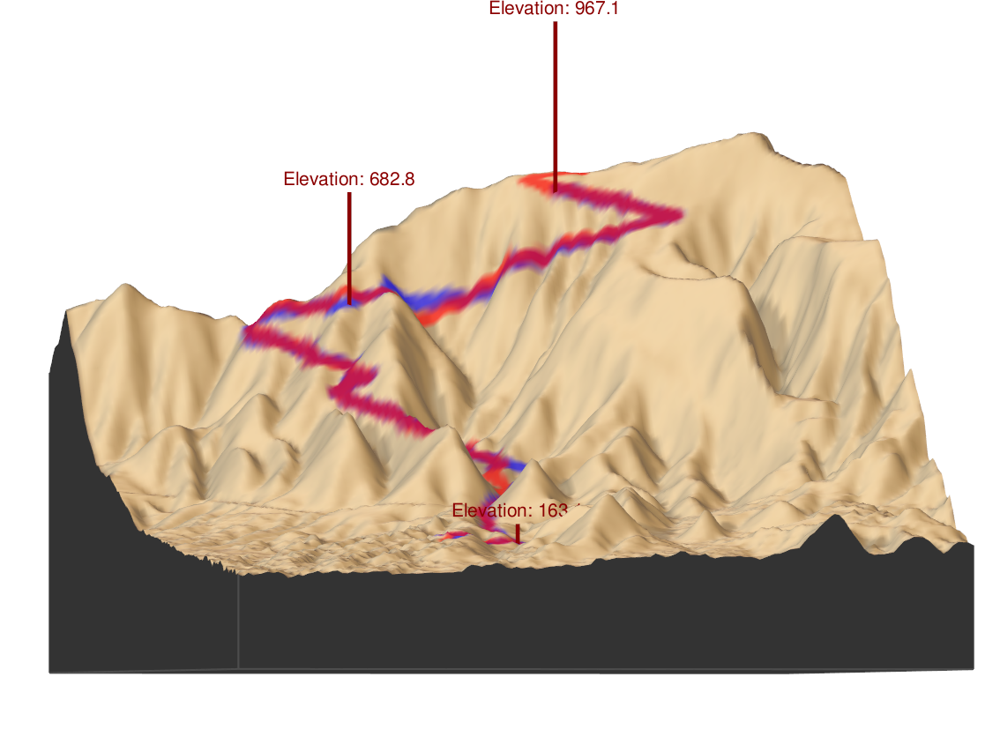

```{r setup, echo = FALSE}

#.................................................
# REFERENCES for cache:
#
#      - https://yihui.org/knitr/demo/cache/
#      - https://yihui.org/knitr/options/#cache
#      - https://stackoverflow.com/a/52163751
#      - https://github.com/yihui/knitr/issues/994
#      - https://stackoverflow.com/a/10629121
#.................................................


build_vignette_with_user_id_token = FALSE

if (build_vignette_with_user_id_token) {
  
  knitr::opts_chunk$set(fig.width = 12,
                        fig.height = 10, 
                        fig.align = "center",
                        warning = FALSE, 
                        message = FALSE,
                        eval = TRUE,
                        echo = TRUE, 
                        cache = TRUE,
                        cache.rebuild = TRUE)    # for 'cache.rebuild' see the references
  
  USER_ID = 'use the true user-id here'
  token = 'use the true token here'
}

if (!build_vignette_with_user_id_token) {
  
  knitr::opts_chunk$set(fig.width = 12,
                        fig.height = 10, 
                        fig.align = "center",
                        warning = FALSE, 
                        message = FALSE)
  
  file_heart = system.file('tests_vignette_rds', 'heart_dat.RDS', package = 'fitbitViz')
  file_sleep = system.file('tests_vignette_rds', 'sleep_ts.RDS', package = 'fitbitViz')
  file_tcx = system.file('tests_vignette_rds', 'res_tcx.RDS', package = 'fitbitViz')
  file_rst = system.file('tests_vignette_rds', 'raysh_rst.tif', package = 'fitbitViz')
  
  heart_dat = readRDS(file = file_heart)
  sleep_ts = readRDS(file = file_sleep)
  res_tcx = readRDS(file = file_tcx)
  raysh_rst = raster::raster(x = file_rst)
}

```

<br>

The purpose of this Vignette is to show the main functionality of the **fitbitViz** R package. You can read more about the **Fitbit** [Web API](https://dev.fitbit.com/build/reference/web-api/) and how to create an application to receive a **token** and the **user-id** in the *README.md* file. For the rest of this vignette I'll assume that the following variables are defined:

<br>

```{r, eval = FALSE}

#..................
# parameter setting
#..................

USER_ID = 'My user-id'             # Specify here your 'user-id'
token = "My token"                 # Specify here your 'token'

```

```{r}

WEEK = 11                         # for this use case pick the 11th week of the year 2021

num_character_error = 135         # print that many character in case of an error

weeks_2021 = fitbitViz:::split_year_in_weeks(year = 2021)         # split a year in weeks

# Start the week at monday (see: https://github.com/tidyverse/lubridate/issues/509)
date_start = lubridate::floor_date(lubridate::ymd(weeks_2021[WEEK]), unit = 'weeks') + 1  

# Add 6 days to the 'date_start' variable to come to a 7-days plot
date_end = date_start + 6

sleep_time_begins = "00H 40M 0S"
sleep_time_ends = "08H 00M 0S"

VERBOSE = FALSE                       # disable verbosity

```

<br>

The previous code snippet uses one week of my personal *Fitbit* data (the *11th week of 2021*) to plot my 

* **heart rate time series**
* **heart rate heatmap**
* **heart rate variability during sleep time**
* **sleep time series**
* **GPS data of outdoor activities**
* **3-dimensional map of activities**

The data for all these functions are available to download using the **csv** buttons in this *Rmarkdown* file.

<br>

### heart rate time series

<br>

The **heart_rate_time_series()** function takes the **user-id**, **token**, the **start-** and **end-dates**, the **start-** and **end-time**, the **detail level** (1 minute) and returns the **heart rate time series**. Each output plot (of the *multiplot*) includes in the **x-axis** the **time** and in the **y-axis** the **heart rate value**. The highest heart rate value (peak) of the day is highlighted using a vertical and horizontal **blue** line,

<br>

```{r, echo = TRUE, out.height = '1000px', eval = FALSE}

#.......................
# heart rate time series
#.......................

heart_dat = fitbitViz::heart_rate_time_series(user_id = USER_ID,
                                              token = token,
                                              date_start = as.character(date_start),
                                              date_end = as.character(date_end),
                                              time_start = '00:00',
                                              time_end = '23:59',
                                              detail_level = '1min',
                                              ggplot_intraday = TRUE,
                                              ggplot_ncol = 2,
                                              ggplot_nrow = 4,
                                              verbose = VERBOSE,
                                              show_nchar_case_error = num_character_error)
heart_dat$plt

```

<br>


<br>

```{r, echo = FALSE}

#...............................................
# DT::datatable() as option to download the data  [ heart rate time series ]
#...............................................

dt_heart_rate_data = data.table::rbindlist(heart_dat$heart_rate_intraday)

dt_heart_rate = DT::datatable(data = dt_heart_rate_data,
                              rownames = FALSE,
                              extensions = 'Buttons',
                              options = list(pageLength = 10,
                                             dom = 'Bfrtip',
                                             buttons = list(list(extend = 'csv',
                                                                 filename = 'heart_rate_time_series'))))
dt_heart_rate

```

<br>

### heart rate heatmap

<br>

The **heart rate heatmap** shows the **min**, **median** and **max** heart rate Levels in the **y-axis** for each day of the specified week (**x-axis**). As the legend shows, the displayed values range from 40 to 220 and higher values appear in *purple* or *orange* color,

<br>


```{r, echo = TRUE, out.height = '1000px', eval = FALSE}

#............................
# heart rate intraday heatmap [ plot options: https://yihui.org/knitr/options/#plots ]
#............................

heart_intra = heart_dat$heart_rate_intraday

hrt_heat = fitbitViz::heart_rate_heatmap(heart_rate_intraday_data = heart_intra, 
                                         angle_x_axis = 0)
hrt_heat

```

<br>


<br>

### heart rate variability during sleep time

<br>

This function computes the **root mean square of successive differences (RMSSD)** and a *higher heart rate variability is linked with better health*. Based on the Fitbit application information and the [Wikipedia article](https://en.wikipedia.org/wiki/Heart_rate_variability) the heart rate variability is computed normally in ms (milliseconds), however I use the *'1min'* rather than the *'1sec'* interval because I observed that it is more consistent,

<br>

```{r, echo = TRUE, eval = FALSE}

#.......................
# heart rate variability
#.......................

hrt_rt_var = fitbitViz::heart_rate_variability_sleep_time(heart_rate_data = heart_dat,
                                                          sleep_begin = sleep_time_begins,
                                                          sleep_end = sleep_time_ends,
                                                          ggplot_hr_var = TRUE,
                                                          angle_x_axis = 25)
hrt_rt_var$hr_var_plot

```

```{r, echo = TRUE}

hrt_rt_var = fitbitViz::heart_rate_variability_sleep_time(heart_rate_data = heart_dat,
                                                          sleep_begin = sleep_time_begins,
                                                          sleep_end = sleep_time_ends,
                                                          ggplot_hr_var = TRUE,
                                                          angle_x_axis = 25)
```

<br>


<br>


```{r, echo = FALSE}

#..............................................
# DT::datatable() of the heart rate variability
#..............................................

dt_heart_rate_var = DT::datatable(data = hrt_rt_var$hr_var_data,
                                  rownames = FALSE,
                                  extensions = 'Buttons',
                                  options = list(pageLength = 10,
                                                 dom = 'Bfrtip',
                                                 buttons = list(list(extend = 'csv',
                                                                     filename = 'heart_rate_variability'))))

dt_heart_rate_var

```

<br>

### sleep time series

<br>

The **sleep time series** visualization is similar to the *Fitbit Mobile* Visualization and in the **x-axis** shows the specified by the user **sleep time interval** whereas in the **y-axis** shows the **sleep Levels** (*wake*, *rem*, *light*, *deep*). Lower levels like *deep sleep* appear in dark blue whereas higher levels like *wake* appear in light blue,

<br>


```{r, echo = TRUE, out.height = '1000px', eval = FALSE}

#.......................
# sleep data time series
#.......................

sleep_ts = fitbitViz::sleep_time_series(user_id = USER_ID,
                                        token = token,
                                        date_start = as.character(date_start),
                                        date_end = as.character(date_end),
                                        ggplot_color_palette = 'ggsci::blue_material',
                                        ggplot_ncol = 2,
                                        ggplot_nrow = 4,
                                        show_nchar_case_error = num_character_error,
                                        verbose = VERBOSE)

sleep_ts$plt_lev_segments

```

<br>


<br>


```{r, echo = FALSE}

#.....................................
# DT::datatable() of the sleep heatmap
#.....................................

dt_sleep_heatmap = DT::datatable(data = sleep_ts$heatmap_data,
                                 rownames = FALSE,
                                 extensions = 'Buttons',
                                 options = list(pageLength = 10,
                                                dom = 'Bfrtip',
                                                buttons = list(list(extend = 'csv',
                                                                    filename = 'sleep_heat_map'))))

dt_sleep_heatmap

```

<br>

### GPS data of outdoor activities

<br>

To make use of the *GPS data* from the Fitbit Application we have first to extract the **log-id** for a time interval after a specified *Date*,

<br>


```{r, echo = TRUE, eval = FALSE}

#...................
# extract the log-id (required for the GPS data)
#...................

log_id = fitbitViz::extract_LOG_ID(user_id = USER_ID,
                                   token = token,
                                   after_Date = as.character(date_start),
                                   limit = 10,
                                   sort = 'asc',
                                   verbose = VERBOSE)
# log_id

```

<br>

Once we have the *log-id* we can define the *time zone* of the route to receive all GPS data,

<br>


```{r, echo = TRUE, eval = FALSE}

#....................................................
# return the gps-ctx data.table for the output log-id
#....................................................

res_tcx = fitbitViz::GPS_TCX_data(log_id = log_id,
                                  user_id = USER_ID,
                                  token = token,
                                  time_zone = 'Europe/Athens',
                                  verbose = VERBOSE)
# res_tcx

```

<br>

The following *Leaflet Point Coordinates* show my outdoor activity during the *11th week of 2021* (the legend shows the elevation of the route),

<br>


```{r, echo = TRUE}

#................................
# Create the Leaflet / LeafGL Map
#................................

res_lft = fitbitViz::leafGL_point_coords(dat_gps_tcx = res_tcx,
                                         color_points_column = 'AltitudeMeters',
                                         provider = leaflet::providers$Esri.WorldImagery,
                                         option_viewer = rstudioapi::viewer,
                                         CRS = 4326)
```

<br>

```{r, echo = TRUE}

res_lft

```

<br>

```{r, echo = FALSE}

#.................................
# DT::datatable() for the GPS data
#.................................

dt_gps_tcx = DT::datatable(data = res_tcx,
                           rownames = FALSE,
                           extensions = 'Buttons',
                           class = 'white-space: nowrap',                 # unwrap the column-contents so that rows become flat, see:  https://github.com/rstudio/DT/issues/353
                           options = list(pageLength = 10,
                                          dom = 'Bfrtip',
                                          buttons = list(list(extend = 'csv',
                                                              filename = 'GPS_TCX_data'))))

dt_gps_tcx

```

<br>

### 3-dimensional plots of activities

<br>

Another option of this package is to plot a route in 3-dimensional space. For this purpose we'll use the [rayshader](https://github.com/tylermorganwall/rayshader) package, which internally uses [rgl](https://github.com/dmurdoch/rgl) (*OpenGL*). First, we have to extend the boundaries of our route for approximately *1.000 thousand meters* (adjust this value depending on your area of interest),

<br>

```{r, echo = FALSE, eval = FALSE}

# reference for the st_buffer function:  https://stackoverflow.com/a/54754935

```


```{r, echo = TRUE}

#...................................................
# compute the sf-object buffer and the raster-extend  (1000 meters buffer)
#...................................................

sf_rst_ext = fitbitViz::extend_AOI_buffer(dat_gps_tcx = res_tcx,
                                          buffer_in_meters = 1000,
                                          CRS = 4326,
                                          verbose = VERBOSE)
# sf_rst_ext

```

<br>

Then for the extended area we will download **Copernicus Digital Elevation Model (DEM)** data. The *Copernicus elevation data* come either in **30** or in **90** meter resolution. We will pick the *30* meter resolution product for this route. The **CopernicusDEM** is an R package, make sure that you have installed and configured the **awscli** Operating System Requirement if you intend to download and reproduce the next 3-dimensional map using the elevation data,

<br>


```{r, echo = TRUE, eval = FALSE}

#..................................................................
# Download the Copernicus DEM 30m elevation data
# there is also the option to download the DEM 90m elevation data
# which is of lower resolution but the image size is smaller which
# means faster download
#..................................................................

dem_dir = tempdir()
# dem_dir

dem30 = CopernicusDEM::aoi_geom_save_tif_matches(sf_or_file = sf_rst_ext$sfc_obj,
                                                 dir_save_tifs = dem_dir,
                                                 resolution = 30,
                                                 crs_value = 4326,
                                                 threads = parallel::detectCores(),
                                                 verbose = VERBOSE)

TIF = list.files(dem_dir, pattern = '.tif', full.names = T)
# TIF

if (length(TIF) > 1) {

  #....................................................
  # create a .VRT file if I have more than 1 .tif files
  #....................................................

  file_out = file.path(dem_dir, 'VRT_mosaic_FILE.vrt')

  vrt_dem30 = CopernicusDEM::create_VRT_from_dir(dir_tifs = dem_dir,
                                                 output_path_VRT = file_out,
                                                 verbose = VERBOSE)
}

if (length(TIF) == 1) {

  #..................................................
  # if I have a single .tif file keep the first index
  #..................................................

  file_out = TIF[1]
}

#.......................................
# crop the elevation DEM based on the
# coordinates extent of the GPS-CTX data
#.......................................

raysh_rst = fitbitViz::crop_DEM(tif_or_vrt_dem_file = file_out,
                                sf_buffer_obj = sf_rst_ext$sfc_obj,
                                CRS = 4326,
                                digits = 6,
                                verbose = VERBOSE)
# sp::plot(raysh_rst)

```

<br>

The GPS route that I use is an *ascending & descending* route therefore we can convert the GPS (TCX) data to a spatial *LINESTRING* by using the maximum altitude as a *split point* of the route to visualize the ascending route in *blue* and the descending in *red* (there is also the alternative to specify the split point based on time using the **time_split_asc_desc** parameter),
 
<br>


```{r, echo = TRUE}

linestring_dat = fitbitViz::gps_lat_lon_to_LINESTRING(dat_gps_tcx = res_tcx,
                                                      CRS = 4326,
                                                      time_split_asc_desc = NULL,
                                                      verbose = VERBOSE)

```

<br>

then we create the *'elevation_sample_points' data.table parameter* for the *3-dim* plot based on the *min.*, *middle*  and *max.* altitude of the previously computed *'res_tcx'* data,

<br>

```{r, echo = TRUE}

idx_3m = c(which.min(res_tcx$AltitudeMeters), 
           as.integer(length(res_tcx$AltitudeMeters) / 2), 
           which.max(res_tcx$AltitudeMeters))

cols_3m = c('latitude', 'longitude', 'AltitudeMeters')
dat_3m = res_tcx[idx_3m, ..cols_3m]

```

<br>

and finally we visualize the *3-dimensional Rayshader Map*,

<br>

```{r, echo = TRUE, eval = FALSE}

snapshot_rayshader_path = file.path(tempdir(), 'rayshader_img.png')

rgl::open3d(useNULL = TRUE)                       # this removes the second rgl-popup-window

fitbitViz::rayshader_3d_DEM(rst_buf = raysh_rst,
                            rst_ext = sf_rst_ext$raster_obj_extent,
                            rst_bbx = sf_rst_ext$buffer_bbox,
                            linestring_ASC_DESC = linestring_dat,
                            elevation_sample_points = dat_3m,
                            zoom = 0.3,
                            windowsize = c(1000, 800),
                            add_shadow_rescale_original = FALSE,
                            verbose = TRUE)

rgl::rgl.snapshot(snapshot_rayshader_path)
rgl::par3d(mouseMode = "trackball")   # options: c("trackball", "polar", "zoom", "selecting")
rgl::rglwidget()

```

<br>



<br>

In the output map we observe

* the *3 specified elevation vertical lines* (including their *altitude values* in meters) 
* in *blue* color the *ascending* route
* in *red* color the *descending* route

<br>

